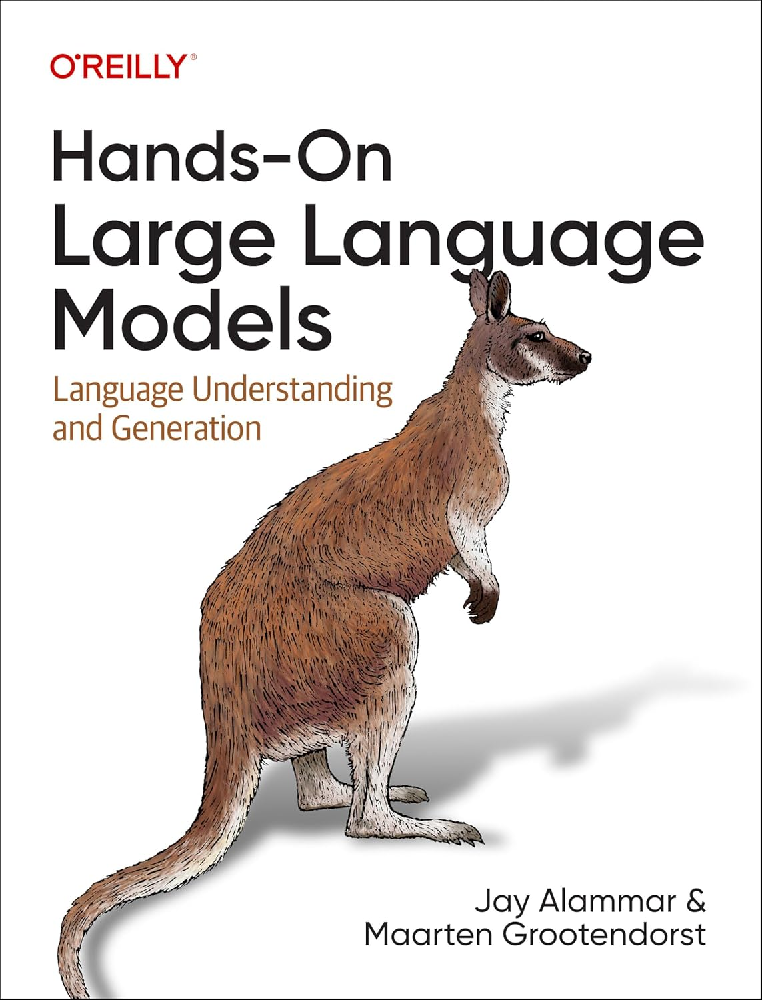
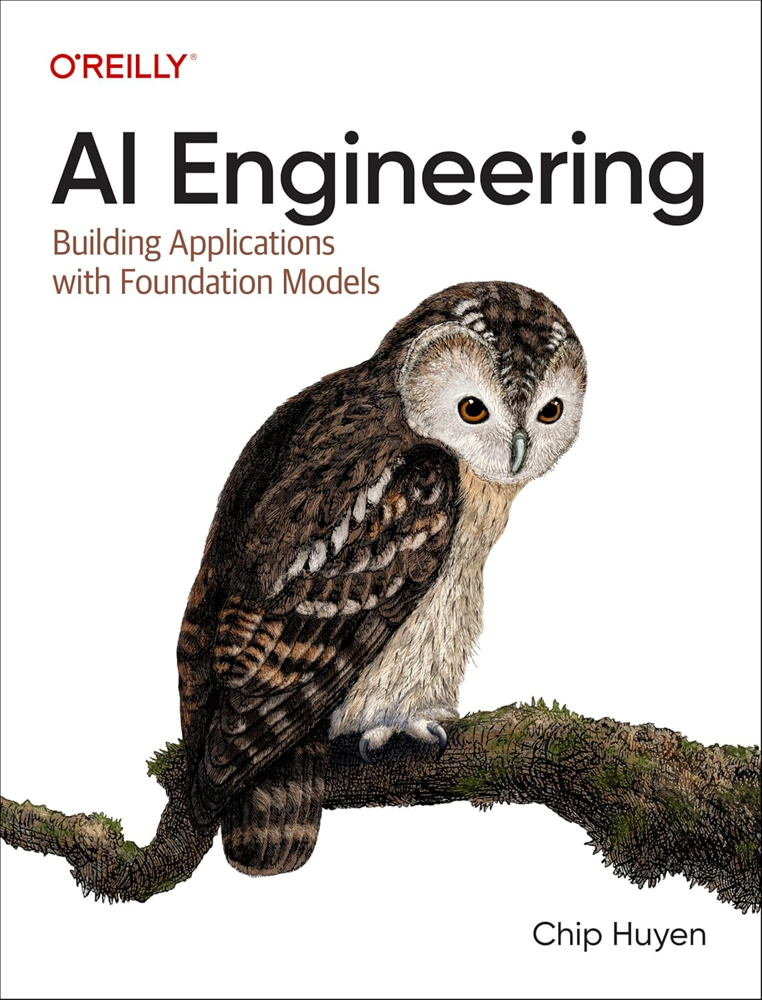
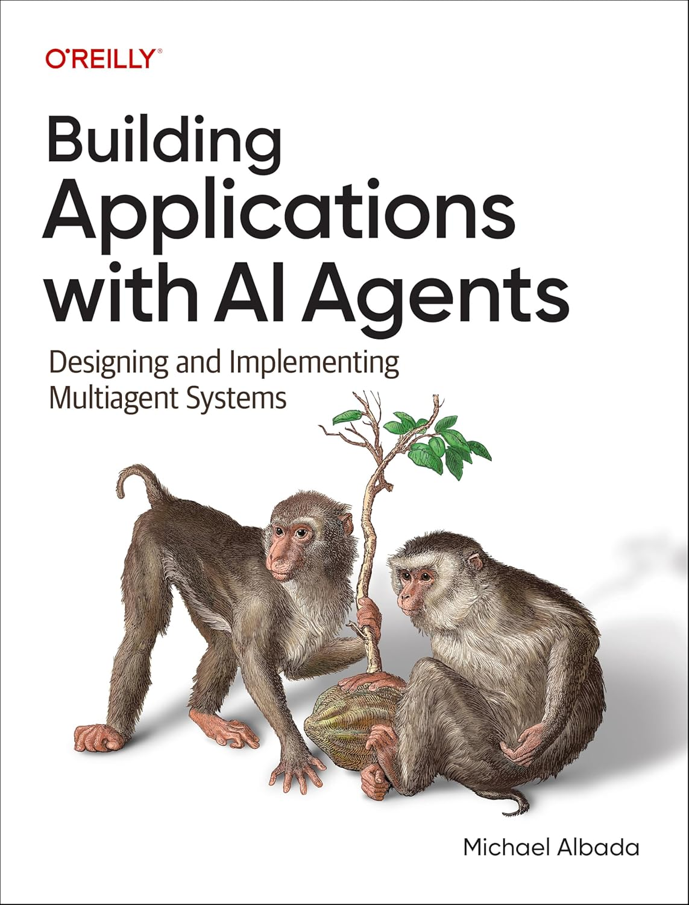

# Engenharia de LLMs e Sistemas Agentic 🤖🧠🛠️

<!-- Core -->

<!-- LLM / Agentic -->

<!-- Databases / Vector -->

---

## 📘 Sobre o curso

Este repositório serve como base oficial do curso _Engenharia de LLMs e Sistemas Agentic_, cujo objetivo é apresentar, de forma teórica e prática, os fundamentos, arquiteturas e padrões modernos utilizados no desenvolvimento de aplicações baseadas em:

- Large Language Models (LLMs)
- Sistemas multiagentes (Agentic Systems)
- Retrieval-Augmented Generation (RAG)
- Model Context Protocol (MCP)
- Avaliação, observabilidade e operação de agentes em produção (AgentOps)

O curso é fortemente orientado à engenharia de sistemas, conectando teoria, implementação e boas práticas utilizadas atualmente na indústria e na pesquisa aplicada.

Este repositório conterá:

- Notebooks e exemplos práticos
- Implementações de agentes
- Pipelines de RAG
- Integrações com APIs de modelos fundacionais
- Projetos guiados
- Materiais de apoio

---

## 👥 Público-alvo

Este curso é destinado a:

- Engenheiros de Machine Learning
- Cientistas de Dados
- Desenvolvedores de software
- Pesquisadores e estudantes em IA

> 🚨 A abordagem assume familiaridade prévia com programação e matemática do ensino médio.

---

## ✔️ Pré-requisitos

É esperado que o aluno possua:

- Lógica de programação
- Noções de Programação Orientada a Objetos (POO)
- Domínio da linguagem Python
- Familiaridade com bancos de dados
- Familiaridade com APIs REST
- Noções de Docker e conteinerização
- Matemática do ensino médio

---

## 📚 Livros utilizados como referência

  
  
  

- **Alammar, J.; Grootendorst, M.**  
  *Hands-On Large Language Models*. 1st ed. O’Reilly, September 2024.

- **Huyen, C.**  
  *AI Engineering*. 1st ed. O’Reilly, December 2024.

- **Albada, M.**  
  *Building Applications with AI Agents*. 1st ed. O’Reilly, September 2025.

---

## 📖 Documentação das ferramentas

Durante o curso, serão utilizadas as seguintes tecnologias e frameworks:

- [OpenAI API](https://platform.openai.com/docs/overview)
- [Google Gemini API](https://ai.google.dev/gemini-api/docs?hl=pt-br)
- [PyTorch](https://pytorch.org/get-started/locally/)
- [HuggingFace Transformers](https://huggingface.co/docs/transformers/quicktour)
- [LangChain](https://docs.langchain.com/oss/python/langchain/overview)
- [LangGraph](https://docs.langchain.com/oss/python/langgraph/overview)
- [DeepAgents](https://docs.langchain.com/oss/python/deepagents/overview)
- [Model Context Protocol (MCP)](https://modelcontextprotocol.io/docs/getting-started/intro)
- [LangSmith](https://docs.langchain.com/langsmith/home)
- [Pinecone](https://docs.pinecone.io/guides/get-started/overview)
- [Neo4j](https://neo4j.com/docs/)
- [FastAPI](https://fastapi.tiangolo.com/)
- [Docker](https://docs.docker.com/get-started/)
- [PostgreSQL](https://docs.langchain.com/oss/python/langgraph/add-memory#example-using-postgres-checkpointer)
- [Redis](https://docs.langchain.com/oss/python/langgraph/add-memory#example-using-redis-checkpointer)
---

## 🗂️ Estrutura do curso

### Módulo 1 — Large Language Models (LLMs)

#### 1.1 Arquitetura Generative Pre-trained Transformer (GPT)
- História e evolução da Inteligência Artificial
- Embeddings e Tokenização
- Positional Encoding
- Dropout
- Blocos Transformer

*Material de apoio*
- [Slide 1](https://www.canva.com/design/DAG-m8JdRiA/KYkexyPi_9zbTNqmz2BWqA/edit?utm_content=DAG-m8JdRiA&utm_campaign=designshare&utm_medium=link2&utm_source=sharebutton)
- [Slide 2](https://www.canva.com/design/DAHAgZR6wSY/5zfTwJXrmbtwYoMT9a4C7g/edit?utm_content=DAHAgZR6wSY&utm_campaign=designshare&utm_medium=link2&utm_source=sharebutton)
- [Configuração do ambiente](/modulos/modulo-1/1.1-arquitetura-gpt//configuracao-ambiente-experimentos.md)
- [Exemplo de implementação](/modulos/modulo-1/1.1-arquitetura-gpt/exemplo-implementacao.ipynb)

*Referências*
- *Alammar, Cap. 1–3*
- *Huyen, Cap. 1–2*

#### 1.2 Post-Training e Eficiência
- Fine-Tuning (LoRA, QLoRA, SFT, RLHF e DPO)
- Quantização
- Small Language Models (SLMs)

*Referências*
- *Alammar, Cap. 7 (p. 200–202), 11–12*
- *Huyen, Cap. 7, 9*
- *Albada, Cap. 7 (p. 146–162)*

*Material de apoio*

- [Slide 1](https://www.canva.com/design/DAHCdy5v8q8/4nqcGrjbPrElYPMZpTAQlw/edit?utm_content=DAHCdy5v8q8&utm_campaign=designshare&utm_medium=link2&utm_source=sharebutton)

#### 1.3 Multimodal Large Language Models (MLLM) e Interface de Modelos
- CLIP/BLIP-2
- Integração via API (OpenAI/Gemini)

*Referências*
- *Alammar, Cap. 9*
- *Albada, Cap. 1 (p. 5-6)*

*Material de apoio*

- [Slide 1](https://www.canva.com/design/DAHDH5j2TIs/eQQDzZENWvaH09V6Cpx4lg/edit?utm_content=DAHDH5j2TIs&utm_campaign=designshare&utm_medium=link2&utm_source=sharebutton)
- [Multimodalide com GPT e GEMINI](/modulos/modulo-1/1.3-mllm-interface-modelos/multimodalidade-gpt-gemini.ipynb)

---
### Módulo 2 — Sistemas Agentic

#### 2.1 Teoria de Agentes
- Memory
- Tools
- Prompt Engineering
- ReAct e Chain-of-Thought (CoT)
- Reflection e Planning
- Deep Agents
- Agents Protocol (A2A, ACP e MCP)
- LLM Routing e Fallbacks
- Guardrails e Proteção contra Prompt Injection
- Human-in-the-loop (HITL)

*Referências*
- *Allamar, Cap. 6, 7 (p. 209–223)*
- *Huyen, Cap. 5, 6 (p. 275–304)*
- *Albada Cap. 1–8, 11 (p. 243–260), 12*

#### 2.2 Geração Aumentada via Recuperação (RAG)
- Bancos Vetoriais
- Métricas de similaridade (Cosseno e Euclidiana)
- Algoritmos de busca (IVF vs HNSW)
- Busca Híbrida
- Agentic RAG
- Graph RAG

*Referências*
- *Alammar, Cap. 8*
- *Huyen, Cap. 6 (p. 253–275)*
- *Albada, Cap. 6*

#### 2.3 Projeto

- Definição do escopo, design da arquitetura do agente e seleção dos Foundation Models

*Referências*
- *Huyen, Cap. 1 (p. 28–35), 10*
- *Albada, Cap. 1 (p. 3-13), 4*

---
### Módulo 3 — LangChain, LangGraph e MCP

#### 3.1 LangChain
- Chains
- Memory
- Tools
- Implementações dos tópicos 2.1 e 2.2

#### 3.2 LangGraph
- Grafos de estado (State Schema)
- Nodes
- Reducers
- Paralelização
- Sub-grafos

#### 3.3 Model Context Protocol (MCP)
- Arquitetura
- Protocolo
- Primitives (Tools, Resources e Prompts)

#### 3.4 Projeto
- Implementação de Tools, integração de bancos vetoriais e orquestração de memória

*Referências*
- *Allamar, Cap. 7*

---
### Módulo 4 — AgentOps e LangSmith

#### 4.1 Avaliação
- Métricas
- Datasets e Experimentos
- Gerenciamento de Prompts
- LLM-as-judge
- Comparação Pairwise
- Testes A/B

*Referências*
- *Huyen, Cap. 3–4*
- *Albada, Cap. 9 e 11 (p. 260-268)*

#### 4.2 Deployment
- LangSmith Cloud
- FastAPI, Postgres e Docker

#### 4.3 Observabilidade
- Tracing
- Runs
- Monitoramento de latência e custo
- Queues e Annotations

*Referências*
- *Huyen, Cap. 10 (p. 465–492)*
- *Albada, Cap. 10*

#### 4.4 Projeto
- Avaliação dos agentes e deploy

---

## 👤 Sobre o autor

<table>
  <tr>
    <td width="200" valign="top" align="center">
      
    </td>
    <td valign="top">
      

        Estudante do Bacharelado em Tecnologia da Informação pela Universidade Federal do Rio Grande do Norte (UFRN).
        Trabalha com IA Generativa, MLOps e Aprendizado de Máquina. Foi estagiário no Senac RN, trabalhando nas mesmas frentes.
        Participou do projeto de pesquisa "IApps: desenvolvimento e entrega de aplicativos inteligentes no contexto de áreas emergentes",
        onde publicou diversos artigos nacionais e um artigo internacional, que já conta com quase 200 visualizações e 2 citações.
        Também foi pesquisador no InovAI Lab, no plano de trabalho "Aprendizagem Profunda Aplicada à Predição de Risco de Mortalidade em
        Recém-nascidos Prematuros" onde foi selecionado para concorrer o 8º prêmio destaque na iniciação científica e tecnológica da UFRN.
        Além disso, atuou como bolsista do Programa de Educação Tutorial (PET) de Ciência da Computação da UFRN e como bolsista de Apoio
        Técnico-Científico no Instituto Metrópole Digital (IMD/UFRN), colaborando com a equipe da plataforma Objetos de Aprendizagem para
        Matemática (OBAMA), onde iniciou sua atuação na área de Ciência de Dados.
      

    </td>
  </tr>
</table>

---

## ⚖️ Licença

Este repositório está licenciado sob a **Creative Commons Attribution–NonCommercial–NoDerivatives 4.0 International (CC BY-NC-ND 4.0)**.

### ✅ Você pode

- Compartilhar o conteúdo para fins educacionais e não comerciais
- Utilizar o material para estudo pessoal

### ❌ Você não pode

- Utilizar o conteúdo para fins comerciais
- Modificar, adaptar ou criar obras derivadas
- Redistribuir versões modificadas do material

Para mais informações, consulte o arquivo [LICENSE](LICENSE) ou a licença oficial em:  
https://creativecommons.org/licenses/by-nc-nd/4.0/deed.pt-br